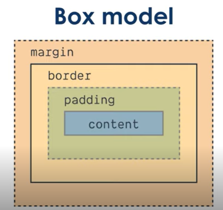

## HTML

## CSS

 - Class são precedidas por `.`
 - id são precedidos por `#`

## Box model

- margin: espaçamento entre elementos;
- border: circunda o padding e o content... esta conseguimos alterar sua aparência.
- padding: espaçamento entre border e content.
- content: o que o box representa.

